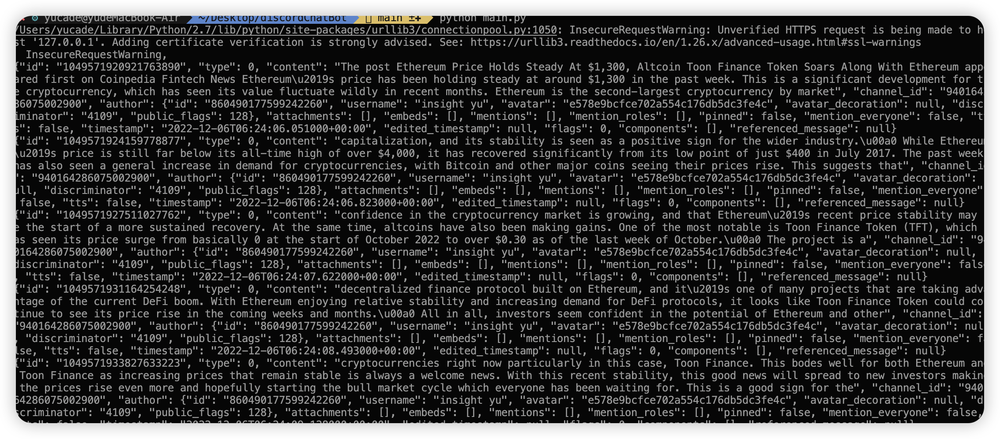

# python简易discord聊天机器人
此脚本自动获取第三方的api向指定的discord频道发送新闻

## 安装第三方库 requests
> pip install requests
******
## 参数说明
**channel_id** : 你要让脚本运行的特定的server的特定channel

打开dc,切换到你想要水的特定channel,调出开发者工具，画线部分就是channel_id

**user_Owen_Authorization** : 包含登陆用户的信息

Authorization : 有用户的用户名等重要信息，同样打开发者工具,切换到网络/Fetch/XMR 画线部分就是用户个人Authorization的

****************************************************************
## 注册第三方api

[newsdata](https://newsdata.io/)

拿到api后，替换

****************************************************************
## 运行脚本
> python main.py
>

